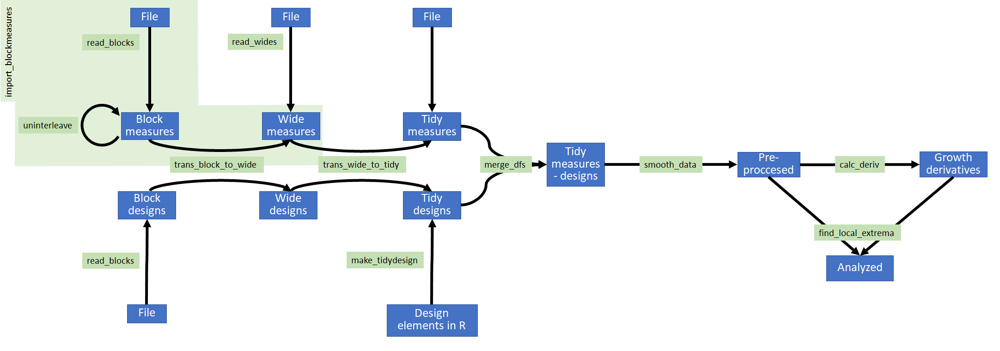

```{r global options, include = FALSE}
knitr::opts_chunk$set(
  collapse = TRUE,
  comment = "#>"
)
```

# Getting started
`gcplyr` is a package that implements a number of functions to make it easier to import, manipulate, and analyze bacterial growth from data collected in multiwell plate readers ("growth curves"). This document gives a walkthrough of how to use `gcplyr`'s most common functions.

All you need is the data file with the growth curves measures saved in a tabular format (.csv, .xls, or .xlsx) to your computer.

Users often want to combine their data with some information on experimental design elements of their growth curves plate(s). For instance, this might include which strains went into which wells. You can save this information into a tabular file as well, or you can just keep it handy to enter it directly through a function later on.

Let's get started by loading `gcplyr`

```{r setup}
library(gcplyr)
```

```{r, include = FALSE}
print_df <- function(df, col.names = FALSE) {
  write.table(format(df, justify = "right"),
              row.names=FALSE, col.names = col.names, quote = F)
}
```


# Data layouts
Growth curves data and design elements can be organized in one of three different tabular layouts: block-shaped, wide-shaped, and tidy-shaped, described below.

Tidy-shaped data is the best layout for analyses, but most plate readers output block-shaped or wide-shaped data, and most user-created design files will be block-shaped. Thus, `gcplyr` works by reshaping block-shaped into wide-shaped data, and wide-shaped data into tidy-shaped data, then running any analyses.

So, what are these three data layouts, and how can you tell which of them your data is in?

### Block-shaped

In block-shaped data, the organization of the data corresponds directly with the layout of the physical multi-well plate it was generated from. For instance, a data point from the third row and fourth column of the data.frame will be from the well in the third row and fourth column in the physical plate. Because of this, a timeseries of growth curve data that is block-shaped will consist of many separate block-shaped data.frames, each corresponding to a single timepoint.

For example, here is a block-shaped data.frame of a 96-well plate (with "..." indicating Columns 4 - 10, not shown). In this example, all the data shown would be from a single timepoint.

|         | Column 1 | Column 2  | Column 3  | ... | Column 11 | Column 12
--------- | -------- | --------  | --------  | --- | --------- | --------
**Row A** | 0.060    | 0.083     | 0.086     | ... | 0.082     | 0.085
**Row B** | 0.099    |0.069      |0.065      | ... |0.066      |0.078
**Row C** | 0.081    |0.071      |0.070      | ... |0.064      |0.084
**Row D** | 0.094    |0.075      |0.065      | ... |0.067      |0.087
**Row E** | 0.052    |0.054      |0.072      | ... |0.079      |0.065
**Row F** | 0.087    |0.095      |0.091      | ... |0.075      |0.058
**Row G** | 0.095    |0.079      |0.099      | ... |0.063      |0.075
**Row H** | 0.056    |0.069      |0.070      | ... |0.053      |0.078


### Wide-shaped

In wide-shaped data, each column of the dataframe corresponds to a single well from the plate, and each row of the dataframe corresponds to a single timepoint. Typically, headers contain the well names.

For example, here is a wide-shaped dataframe of a 96-well plate (here, "..." indicates the 91 columns A4 - H10, not shown). Each row of this dataframe corresponds to a single timepoint.

Time      | A1 | A2 | A3  | ... | H11 | H12
--------- | -------- | --------  | --------  | --- | --------- | --------
0 | 0.060    | 0.083     | 0.086     | ... | 0.053     | 0.078
1 | 0.012    |0.166      |0.172      | ... |0.106      |0.156
2 | 0.024    |0.332      |0.344      | ... |0.212      |0.312
3 | 0.048    |0.664      |0.688      | ... |0.424      |0.624
4 | 0.096    |1.128      |0.976      | ... |0.848      |1.148
5 | 0.162    |1.256      |1.152      | ... |1.096      |1.296
6 | 0.181    |1.292      |1.204      | ... |1.192      |1.352
7 | 0.197    |1.324      |1.288      | ... |1.234      |1.394

### Tidy-shaped

In tidy-shaped data, there is a single column that contains all the plate reader measurements, with each unique measurement having its own row. Additional columns specify the timepoint, which well the data comes from, and any other design elements.

Note that, in tidy-shaped data, the number of rows equals the number of wells times the number of timepoints. For instance, with a 96 well plate and 96 timepoints, that will be 9216 rows. (Yes, that's a lot of rows! But don't worry, tidy-shaped data is the best format for downstream analyses.) Tidy-shaped data is common in a number of R packages, including ggplot where it's sometimes called a "long" format. If you want to read more about tidy-shaped data and why it's ideal for analyses, see: Wickham, Hadley. Tidy data. The Journal of Statistical Software, vol. 59, 2014. for more details.


Timepoint | Well | Measurement | 
--------- | -------- | ------- | 
1         | A1       | 0.060   | 
1         | A2       | 0.083   | 
1         | A3       | 0.086   | 
...       |...       | ...     |
7         | H10      | 1.113   | 
7         | H11      | 1.234   | 
7         | H12      | 1.394   | 

# Importing data
Once you've determined what format your data is in, you can begin importing it using the `read_` functions of `gcplyr`. If your data is block-shaped, you'll use `read_blocks`. If your data is wide-shaped, you'll use `read_wides`. In the unlikely event your data is already tidy, you can simply read it using the built-in R function `read.table`.

## Importing block-shaped data
To import block-shaped data, use the `read_blocks` function. `read_blocks` only requires a list of filenames (or relative file paths) and will return a list of data.frames, with each data.frame corresponding to a single block. 

### The simplest example

```{r, include = FALSE}
#This code just creates a set of example files with no time added
temp_filenames <- 
  tempfile(pattern = paste(as.character(example_widedata$Time), "_", sep = ""),
                           fileext = ".csv")
for (i in 1:length(temp_filenames)) {
  write.table(
    cbind(matrix(c("", "A", "B", "C", "D", "E", "F", "G", "H"), nrow = 9),
          rbind(
            matrix(1:12, ncol = 12),
            matrix(example_widedata[i, 2:ncol(example_widedata)], ncol = 12))), 
    file = temp_filenames[i], quote = FALSE, row.names = FALSE, sep = ",",
    col.names = FALSE)
}
```

Here's a simple example. We've created a series of example block-shaped .csv files (under the hood, so you don't have to worry about it), and stored the file names in `temp_filenames`. Here's what one of the files looks like (where the values are bacterial density):

```{r}
print_df(read.csv(temp_filenames[1], header = FALSE))
```

This would correspond to all the reads for a single plate taken at the very first timepoint. We can see that the first row contains column headers, and the first column contains row names. Moreover, we can see that at this timepoint the wells on the left-hand-side of the plate have a different density than on the right-hand-side.

If we want to read these files into R, we simply provide `read_blocks` with the vector of file names.

```{r}
imported_blockdata <- read_blocks(files = temp_filenames)
```

### Specifying the location of your block-shaped data

```{r, include = FALSE}
#This code just creates a set of example files with time added in the first row
temp_filenames2 <- 
  tempfile(pattern = paste(as.character(example_widedata$Time), "_2_", sep = ""),
                           fileext = ".csv")
for (i in 1:length(temp_filenames2)) {
  write.table(
    cbind(matrix(c("", "", "", "", "A", "B", "C", "D", "E", "F", "G", "H"), 
                 nrow = 12),
          rbind(
            rep("", 12),
            matrix(c("Time", example_widedata$Time[i], rep("", 10)), ncol = 12),
            rep("", 12),
            matrix(1:12, ncol = 12),
            matrix(example_widedata[i, 2:ncol(example_widedata)], ncol = 12))), 
    file = temp_filenames2[i], quote = FALSE, row.names = FALSE, sep = ",",
    col.names = FALSE)
}
```

However, this only works if the data in your block-shaped files starts in the first row and column (or has column names in the first row and/or rownames in the first column). If your data starts elsewhere, `read_blocks` needs to know what row/column to start reading on (if your data isn't the last thing in the file, `read_blocks` also needs to know where your data ends). For instance, in this set of example files, the timepoint of each block is stored in the 2nd row of the file, and the data itself starts with a header on the 4th row:

```{r}
print_df(read.csv(temp_filenames2[1], header = FALSE))
```

Thus, we can see the column names are in row 4 and the rownames are in column 1. To specify that to `read_blocks`, we simply do:

```{r}
#Now let's read it with read_blocks
imported_blockdata <- read_blocks(
  files = temp_filenames,
  startrow = 4, startcol = 1)
```

If you're looking at your data in Excel or a similar spreadsheet program, you'll notice that the columns aren't nicely numbered. Instead, they're coded by letter. Rather than have to count by hand what columns your data starts and ends on, just specify the column by letter and `read_blocks` will translate that to a number for you!

```{r}
#Now let's read it with read_blocks
imported_blockdata <- read_blocks(
  files = temp_filenames,
  startrow = 4, startcol = "A")
```

Additionally, some plate readers might output growth curves data in a block shape but in a single file. For instance, the file may contain the block from lines 1 - 8, then an empty line, then the next block from lines 10 - 17, etc. Since `read_blocks` is vectorized on most of its input arguments, including `startrow`, `startcol`, `endrow`, and `endcol`, such a layout can be specified by passing a vector of startrows and endrows to `read_blocks`:

```{r, eval = FALSE}
imported_blockdata <- read_blocks(
  files = "example_file.csv",
  startrow = c(1, 10, 19, 28, 37, 46, 55),
  endrow = c(8, 17, 26, 35, 44, 53, 62))
```


### Specifying metadata

Sometimes, your input files will have information you want to import that's not included in the main block of data. For instance, with block-shaped data the timepoint is nearly always specified somewhere in the input file. `read_blocks` can include that information as well via the `metadata` argument. 

The `metadata` argument should be a list of named vectors. Each vector should be of length 2, with the first entry specifying the row and the second entry specifying the column where the metadata is located.

For example, in our previous example files, the timepoint information was located in the 2nd row and 3rd column. Here's how we could specify that metadata:

```{r}
#Reading the blockcurves files with metadata included
imported_blockdata <- read_blocks(
  files = temp_filenames2,
  startrow = 4, startcol = "A",
  metadata = list("time" = c(2, 3)))
```

And just like how you can specify `startrow`, `startcol`, etc. with Excel-style lettering, the location of metadata can also be specified with Excel-style lettering.


## Importing wide-shaped data
To import wide-shaped data, use the `read_wides` function. `read_wides` only requires a filename (or vector of filenames, or relative file paths) and will return a data.frame (or list of data.frames). 

### The simplest example
```{r, include = FALSE}
#Let's create an example file
temp_filename <- paste(tempfile(), ".csv", sep = "")
write.csv(example_widedata, file = temp_filename, row.names = FALSE)
```

Here's a simple example. We've created a wide-shaped .csv file (under the hood, so you don't have to worry about it), and stored the file name in `temp_filename`. Here's what the start of the file looks like (where the values are bacterial density):

```{r}
print_df(head(read.csv(temp_filename, header = FALSE), 
              c(10, 4), row.names = FALSE))
```

This would correspond to all the reads for a single plate taken across all timepoints. For instance, we can see that the first column contains the timepoint information, and each subsequent column corresponds to a well in the plate.

If we want to read these files into R, we simply provide `read_wides` with the file name.

```{r}
#Now let's use read_wides to import our wide-shaped data
imported_widedata <- read_wides(files = temp_filename)
```

This also works if we have multiple files we'd like to read in. In this case, read_wides will return a list containing all the data.frames:

```{r}
#If we had multiple wide-shaped data files to import
imported_widedata <- read_wides(files = c(temp_filename, temp_filename))
```

### Specifying the location of your wide-shaped data

```{r, include = FALSE}
#Let's save an example file where the data doesn't start right away
temp_filename2 <- tempfile(fileext = ".csv")
temp_example_widedata <- example_widedata
colnames(temp_example_widedata) <- paste("V", 1:ncol(temp_example_widedata),
                                         sep = "")
modified_example_widedata <-
  rbind(
    as.data.frame(matrix("", nrow = 4, ncol = ncol(example_widedata))),
    colnames(example_widedata),
    temp_example_widedata)
modified_example_widedata[1:2, 1:2] <- 
  c("Experiment name", "Start date", "Experiment_1", as.character(Sys.Date()))

write.table(modified_example_widedata, file = temp_filename2, 
          row.names = FALSE, col.names = FALSE, sep = ",")
```

However, this only works if the data in your wide-shaped files starts in the first column and in the first row with a header. If your data starts elsewhere, `read_wides` needs to know what row/column to start reading on (if your data isn't the last thing in the file, `read_wides` also needs to know where your data ends). For instance, in this set of example files, some other information is output by the plate reader in the first few rows:

```{r}
#Let's take a peek at what this file looks like
print_df(head(read.csv(temp_filename2, header = FALSE), c(10, 4)))
```

Thus, we can see the data header is in row 5, and the data begins in row 6. To specify that to `read_wides`, we simply do (note that `header = TRUE` by default):

```{r}
imported_widedata <- read_wides(files = temp_filename2,
                                startrow = 5)
print_df(head(imported_widedata, c(6, 6)))
```

If you're looking at your data in Excel or a similar spreadsheet program, you'll notice that the columns aren't nicely numbered. Instead, they're coded by letter. Rather than have to count by hand what columns your data starts and ends on, just specify the column by letter and `read_wides` will translate that to a number for you! (in this example we don't have to specify a start column, since the data starts in the first column, but we do so just to show this letter-style functionality).

```{r}
imported_widedata <- read_wides(files = temp_filename2,
                                startrow = 5, startcol = "A")
```

### Specifying metadata

Sometimes, your input files will have information you want to import that's not included in the main block of data. For instance, many readers will output information like the experiment name and date into a header in the file. `read_wides` can include that information as well via the `metadata` argument.

The `metadata` argument should be a list of named vectors. Each vector should be of length 2, with the first entry specifying the row and the second entry specifying the column where the metadata is located.

For example, in our previous example files, the experiment name was located in the 2nd row, 2nd column, and the start date was located in the 3rd row, 2nd column. Here's how we could specify that metadata:

```{r}
imported_widedata <- read_wides(files = temp_filename2,
                                startrow = 5,
                                metadata = list("experiment_name" = c(1, 2),
                                                "start_date" = c(2, 2)))
print_df(head(imported_widedata, c(6, 6)))
```

And just like how you can specify `startrow`, `startcol`, etc. with Excel-style lettering, the location of metadata can also be specified with Excel-style lettering.

# Transforming data
Now that you've gotten your data into the R environment, we need to transform it before we can do analyses. To reiterate, this is necessary because most plate readers that generate growth curves data outputs it in block-shaped or wide-shaped files, but tidy-shaped data.frames are the best shape for analyses.

You can transform your data.frames using the `trans_\*` functions in `gcplyr`.

## Transforming from block-shaped to wide-shaped

If the data you've read into the R environment is block-shaped, you'll first transform it to wide-shaped using `trans_block_to_wide`. All you need to do is provide `trans_block_to_wide` with the R object created by `read_blocks`.

```{r}
imported_blocks_now_wide <- trans_block_to_wide(imported_blockdata)
```

Note that `trans_block_to_wide` automatically detected the metadata that `read_blocks` had pulled from our files, and has stored each piece of metadata as a column in our output file.

```{r}
print(head(imported_blocks_now_wide, c(1, 5)), row.names = FALSE)
```

Now that your block-shaped data has been transformed to wide-shaped data, you can use `trans_wide_to_tidy` (below) to further transform it into the tidy-shaped data we need for our analyses.

## Transforming from wide-shaped to tidy-shaped

If the data you've read into the R environment is wide-shaped (or you've gotten wide-shaped data by transforming your originally block-shaped data), you'll transform it to tidy-shaped using `trans_wide_to_tidy`. 

First, you need to provide `trans_wide_to_tidy` with the R object created by `read_wides` or by `trans_block_to_wide`. Then, you have to specify either the columns your data (the spectrophotometric measures) are in via `data_cols`, or what columns your non-data (e.g. time and other information) are in via `id_cols`.


```{r}
imported_blocks_now_tidy <- trans_wide_to_tidy(
  wides = imported_blocks_now_wide,
  id_cols = c("block_name", "time"))

imported_wides_now_tidy <- trans_wide_to_tidy(
  wides = imported_widedata,
  id_cols = c("file", "experiment_name", "start_date", "Time"))
```

# Including design elements
Often during analysis of growth curves data, we'd like to incorporate information on the experimental design. For example, which bacteria are present in which wells, or which wells have received some treatment (whether it be changes in growth media, antibiotics, phage presence, etc). `gcplyr` enables incorporation of design elements in two ways:
1. Design elements can be imported from files using `read_\*` functions
2. Design elements can be generated programmatically using `make_tidydesign`

## Reading design elements from files
Just like spectrophotometric data, design elements that are saved in tabular data files can be read using the `read_\*` functions. Simply use `read_blocks` or `read_wides` to read such files into the R environment.

Then, just as for spectrophotometric data, use the `trans_\*` functions to transform this data into tidy-shaped.

[More details on how design elements should best be saved]

## Generating tidy-shaped design elements programmatically
`gcplyr` also has the ability to generate tidy-shaped design dataframes from arguments via `make_tidydesign`. `make_tidydesign` allows generation of dataframes with multiple design elements, each of which can have multiple values.

`make_tidydesign` is written so that design elements can be specified according to their spatial location in the multiwell plate. The resulting dataframe, however, is already tidy-shaped, so that users do not have to transform the resulting design elements dataframe.

### An example
For example, let's imagine a growth curves experiment where a 96 well plate (12 columns and 8 rows) has a different media in each column in the plate, but the first and last columns and first and last rows were left empty.

Row names | Column 1 | Column 2 | Column 3 | ... | Column 11 | Column 12
--------- | -------- | -------- | -------- | --- | --------- | --------
Row A     | Blank    | Blank    | Blank    | ... | Blank     | Blank
Row B     | Blank    | Media #1 | Media #2 | ... | Media #10 | Blank
...       |...       | ...      | ...      | ... | ...       | ... 
Row G     | Blank    | Media #1 | Media #2 | ... | Media #10 | Blank
Row H     | Blank    | Blank    | Blank    | ... | Blank     | Blank

To generate a tidy-shaped design dataframe representing this information, we can use `make_tidydesign`. 
Each design element has the following structure
'name_of_design_element' = list(
* a vector containing the possible values
* a vector containing all the rows these values should be applied to
* a vector containing all the columns these values should be applied to
* a string of the pattern itself within those rows and columns
* an optional Boolean for whether this pattern should be filled byrow (defaults to TRUE)
)

```{r}
my_design <- make_tidydesign(
  nrows = 8, ncols = 12, lookup_tbl_start = "a",
  Media = list(c("Media 1", "Media 2", "Media 3",
                 "Media 4", "Media 5", "Media 6",
                 "Media 7", "Media 8", "Media 9",
                 "Media 10", "Media 11", "Media 12"),
               2:7,
               2:11,
               "abcdefghij"))
head(my_design, 20)
```

### A few notes on the pattern string
In order to fill in the values, make_tidydesign uses `strsplit` to split the pattern string with the split character specified by `pattern_split`.

If this splitting results in pattern items that are more than 1 character long, all pattern items must be numeric.

If this splitting results in pattern items that are all only 1 character long, the items can be alpha numeric. Items will be indexed against a lookup table that has the following order: first, the numbers, starting with 1 and proceeding up to 9, then, capitalized letters, starting with A and proceeding up to Z, then, lowercase letters, starting with a and proceeding up to z.

Note that you can mix numbers, capitalized letters, and lowercase letters, but a warning will be issued if the utilized items are not consecutive in the lookup table.

0 is a reserved character for `NA` values to be filled in.

### Continuing with the example
Returning to the previous example, now let's imagine in the same experiment we also loaded a different bacterial strain into each row of the plate. 

Row names | Column 1 | Column 2  | Column 3  | ... | Column 11 | Column 12
--------- | -------- | --------  | --------  | --- | --------- | --------
Row A     | Blank    | Blank     | Blank     | ... | Blank     | Blank
Row B     | Blank    | Strain #1 | Strain #1 | ... | Strain #1 | Blank
Row B     | Blank    | Strain #2 | Strain #2 | ... | Strain #2 | Blank
...       |...       | ...       | ...       | ... | ...       | ... 
Row G     | Blank    | Strain #5 | Strain #5 | ... | Strain #5 | Blank
Row G     | Blank    | Strain #6 | Strain #6 | ... | Strain #6 | Blank
Row H     | Blank    | Blank     | Blank     | ... | Blank     | Blank

We can generate that design by adding an additional argument to our make_tidydesign call.

```{r}
my_design <- make_tidydesign(
  nrows = 8, ncols = 12, lookup_tbl_start = "a",
  Media = list(c("Media 1", "Media 2", "Media 3",
                 "Media 4", "Media 5", "Media 6",
                 "Media 7", "Media 8", "Media 9",
                 "Media 10", "Media 11", "Media 12"),
               2:7,
               2:11,
               "abcdefghij"),
  Bacteria = list(c("Strain 1", "Strain 2", "Strain 3",
                    "Strain 4", "Strain 5", "Strain 6"),
                  2:7,
                  2:11,
                  "abcdef",
                  FALSE))
head(my_design, 20)
```

Finally, let's imagine that we later discover that Bacterial Strain 4 and Media #6 were contaminated, and we'd like to exclude them from our analyses by marking them as `NA` in the design. We can simply modify our pattern string, placing a 0 anywhere we would like an `NA` to be filled in.

```{r}
my_design <- make_tidydesign(
  nrows = 8, ncols = 12, lookup_tbl_start = "a",
  Media = list(c("Media 1", "Media 2", "Media 3",
                 "Media 4", "Media 5", "Media 6",
                 "Media 7", "Media 8", "Media 9",
                 "Media 10", "Media 11", "Media 12"),
               2:7,
               2:11,
               "abcde0ghij"),
  Bacteria = list(c("Strain 1", "Strain 2", "Strain 3",
                    "Strain 4", "Strain 5", "Strain 6"),
                  2:7,
                  2:11,
                  "abc0ef",
                  FALSE))
head(my_design, 20)
```

Note that `make_tidydesign` is not limited to simple alternating patterns. The pattern string specified can be any pattern, which `make_tidydesign` will replicate sufficient times to cover the entire set of listed wells.

```{r}
my_design <- make_tidydesign(
  nrows = 8, ncols = 12, lookup_tbl_start = "a",
  Media = list(c("Media 1", "Media 2", "Media 3"),
               2:7,
               2:11,
               "aabbbc000abc"),
  Bacteria = list(c("Strain 1", "Strain 2"),
                  2:7,
                  2:11,
                  "abaaabbbab",
                  FALSE))
head(my_design, 20)
```

`gcplyr` also includes a helper function, `make_designpattern`, which simply facilitates the specification of the design elements by formatting them into a list and reminding users of the essential components that must be provided. For example, the following code produces the exact same design output as the earlier example:

```{r}
my_design <- make_tidydesign(
  nrows = 8, ncols = 12, lookup_tbl_start = "a",
  Media = make_designpattern(
    values = c("Media 1", "Media 2", "Media 3",
               "Media 4", "Media 5", "Media 6",
               "Media 7", "Media 8", "Media 9",
               "Media 10", "Media 11", "Media 12"),
    rows = 2:7, cols = 2:11, pattern = "abcde0ghij"),
  Bacteria = make_designpattern(
    values = c("Strain 1", "Strain 2", "Strain 3",
               "Strain 4", "Strain 5", "Strain 6"),
    rows = 2:7, cols = 2:11, pattern = "abc0ef",
    FALSE))
head(my_design, 20)
```


# Merging spectrophotometric and design data
Design and spectrophotometric data can be combined using `merge_dfs`, from which point they can be pre-processed and analyzed using additional functions.


# Pre-processing data

# Analyzing data


# Handling multiple plates simultaneously


# Overview of gcplyr functions

*This figure needs updating*
{#id .class width=7in height=2.45in}


# Text graveyard


Additionally, there are broadly two classes of growth curves-related information to be manipulated: numerical spectrophotometric data, and experimental design elements. If reading from files, `gcplyr` can read both classes of information, transform them, and merge them for subsequent analyses. `gcplyr` also contains the capability of specifying design elements programmatically, which can then be merged with imported spectrophotometric data.

Once spectrophotometric data and design elements have been combined, this merged measures-designs tidy-shaped dataframe can be used for subsequent pre-processing and analyses.


Note that `gcplyr` can handle multiple plates throughout this process, using lists which contain the corresponding single-plate data.frames as elements. Once design elements have been merged with these data.frames so that independent plates can be distinguished, multiple-plate lists can be collapsed together into a single tidy-shaped measures-designs dataframe using `merge_dfs`.